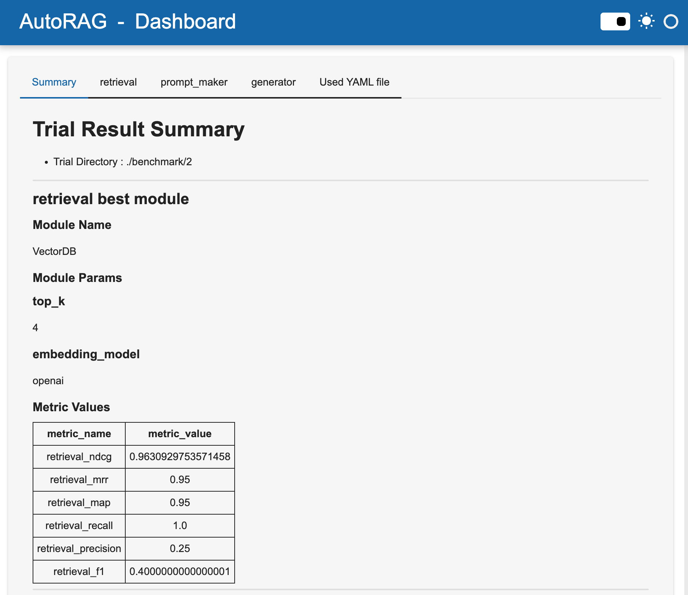

# ARPO-AutoRAG
ARPO의 성능 평가를 위해 AutoRAG를 사용합니다.


## virtualenv를 통해 python 실행환경 설정  
$ virtualenv .venv --python=python3.11.10

## 설치
```bash
pip install -r requirements.txt
```
만약, pip's dependency resolver takes way too long to solve the conflict 에러가 발생한다면 아래 옵션을 추가해서 설치
```bash
pip install -r requirements.txt --use-deprecated=legacy-resolver
```
위를 실행하면 자동으로 AutoRAG가 설치됩니다.

`.env_template` 파일을 참고하여 `.env` 파일을 생성하여 OPENAI_API_KEY를 입력하세요.

## 프로젝트 구동
### 트러블 슈팅
- FileNotFoundError: [Errno 2] JVM DLL not found: /Library/Java/JavaVirtualMachines/adoptopenjdk-8.jdk/Contents/Home/jre/lib/jli/libjli.dylib 발생시 JAVA_HOME 설정
```bash
export JAVA_HOME=/Library/Java/JavaVirtualMachines/jdk-23.jdk/Contents/Home
```

### main.py 이용

1. `.env.template` 파일을 복사하여 `.env` 파일을 만들고 저장합니다. 반드시 본인의 OpenAI api key를 이 파일에 적어주세요.
2. 아래처럼 main.py를 실행하여 AutoRAG를 구동하세요.
```bash
python3 main.py --config ./config/tutorial_ko.yaml
```
3. benchmark 폴더가 생성되면 거기서 결과를 확인할 수 있습니다.

### cli 이용

1. `benchmark` 폴더를 만들어 줍니다.
2. `OPENAI_API_KEY`를 환경변수로 설정합니다. `export OPENAI_API_KEY=sk-xxxx` 
3. 아래 cli 명령을 실행하여 AutoRAG 최적화를 시작합니다.
```bash
autorag evaluate --qa_data_path ./data/qa.parquet --corpus_data_path ./data/corpus.parquet \
  --config ./config/tutorial_ko.yaml --project_dir ./benchmark
```
위 데이터셋 튜토리얼에서 제작한 데이터셋으로 실행하려면, 
`corpus.parquet`을 `corpus_new.parquet`, `qa.parquet`을 `qa_new.parquet`으로 바꿔주세요.
4. benchmark 폴더가 생성되면 거기서 결과를 확인할 수 있습니다.

### 대시보드 실행

아래 명령을 실행하여 대시보드를 로드합니다. 대시보드를 통해 결과를 아주 쉽게 검토할 수 있습니다.

```bash
# Sample : benchmark #2
autorag dashboard --trial_dir ./benchmark/2
```

### streamlit 실행
streamlit을 실행하여 직접 최적화된 RAG를 사용해 볼 수 있습니다. 
아래 명령을 실행하세요.

```bash
# Sample : benchmark #2
autorag run_web --trial_path ./benchmark/2
```

#### 이런 질문을 해보세요.
- 스타벅스에서 사용가능한 쿠폰을 찾아줘
- 초콜릿을 구매할 수 있는 쿠폰을 찾아줘
- 유효기간이 2024년 12월인 쿠폰을 찾아줘
- 케이크를 구매할 수 있는 쿠폰은?
- 치킨을 주문할 수 있는 쿠폰을 찾아줘
- GS 편의점에서 사용 가능한 쿠폰은?
- 커피를 살 수 있는 쿠폰은?